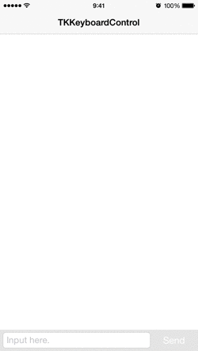

# TKKeyboardControl

TKKeyboardControl adds keyboard awareness and scrolling dismissal (like iMessages app) to any view with only 1 line of code **for Swift4** and it supports **SafeArea**.
This library is inspired by [DAKeyboardControl](https://github.com/danielamitay/DAKeyboardControl).


[](https://img.shields.io/badge/Cocoapods-compatible-brightgreen.svg?style=flat-square)
[](http://cocoapods.org/pods/TKKeyboardControl)
[](http://mit-license.org)




## Features
- [x] Keyboard closing without UIScrollView
- [x] Support `Swift4`
- [x] Support `Safe Area`

## Installation

#### CocoaPods

TKKeyboardControl is available through [CocoaPods](http://cocoapods.org). To install
it, simply add the following line to your Podfile:

```ruby
pod 'TKKeyboardControl'
```

#### Manually

Add the [TKKeyboardControl](./TKKeyboardControl) directory to your project.

## Usage

Example project included (./Example)

### Adding pan-to-dismiss (functionality introduced in iMessages)

#### Frame based action handler

```swift
view.addKeyboardPanning(frameBasedActionHandler: { keyboardFrameInView, opening, closing in
    // Move interface objects accordingly
    // Animation block is handled for you
})
// Make sure to call self.view.removeKeyboardControl before the view is released.
// (It's the balancing call)
```

#### Constraint based action handler

```swift
view.addKeyboardPanning(constraintBasedActionHandler: { keyboardFrameInView, opening, closing in
    // Move interface objects accordingly
    // Animation block is handled for you
})
// Make sure to call self.view.removeKeyboardControl before the view is released.
// (It's the balancing call)
```

### Adding keyboard awareness (appearance and disappearance only)

#### Frame based action handler

```swift
view.addKeyboardNonpanning(frameBasedActionHandler: { keyboardFrameInView, opening, closing in
    // Move interface objects accordingly
    // Animation block is handled for you
})
// Make sure to call self.view.removeKeyboardControl before the view is released.
// (It's the balancing call)
```

#### Constraint based action handler

```swift
view.addKeyboardNonpanning(constraintBasedActionHandler: { keyboardFrameInView, opening, closing in
    // Move interface objects accordingly
    // Animation block is handled for you
})
// Make sure to call self.view.removeKeyboardControl before the view is released.
// (It's the balancing call)
```

### Supporting an above-keyboard input view

The `keyboardTriggerOffset` property allows you to choose at what point the user's finger "engages" the keyboard.

```swift
view.keyboardTriggerOffset = 44.0;	// Input view frame height

view.addKeyboardNonpanning(frameBasedActionHandler: { keyboardFrameInView, opening, closing in
    // Move interface objects accordingly
    // Animation block is handled for you
})
// Make sure to call self.view.removeKeyboardControl before the view is released.
// (It's the balancing call)
```

### Dismissing the keyboard (convenience method)

```swift
view.hideKeyboard()
```

### Remove the NSNotification observer at the end of a VC's life (convenience method)

```swift
view.removeKeyboardControl()
```

## Notes

### Automatic Reference Counting (ARC) support
`TKKeyboardControl` was made with ARC enabled by default.

## Requirements

- Xcode 8.0 or greater
- iOS9.0 or greater
- Swift4.0 or greater

## Author

Keisuke Tatsumi, nietzsche.god.is.dead@gmail.com

## License

TKKeyboardControl is available under the MIT license.

### MIT License

Copyright (c) 2018 Keisuke Tatsumi

Permission is hereby granted, free of charge, to any person obtaining a copy
of this software and associated documentation files (the "Software"), to deal
in the Software without restriction, including without limitation the rights
to use, copy, modify, merge, publish, distribute, sublicense, and/or sell
copies of the Software, and to permit persons to whom the Software is
furnished to do so, subject to the following conditions:

The above copyright notice and this permission notice shall be included in
all copies or substantial portions of the Software.

THE SOFTWARE IS PROVIDED "AS IS", WITHOUT WARRANTY OF ANY KIND, EXPRESS OR
IMPLIED, INCLUDING BUT NOT LIMITED TO THE WARRANTIES OF MERCHANTABILITY,
FITNESS FOR A PARTICULAR PURPOSE AND NONINFRINGEMENT. IN NO EVENT SHALL THE
AUTHORS OR COPYRIGHT HOLDERS BE LIABLE FOR ANY CLAIM, DAMAGES OR OTHER
LIABILITY, WHETHER IN AN ACTION OF CONTRACT, TORT OR OTHERWISE, ARISING FROM,
OUT OF OR IN CONNECTION WITH THE SOFTWARE OR THE USE OR OTHER DEALINGS IN
THE SOFTWARE.
